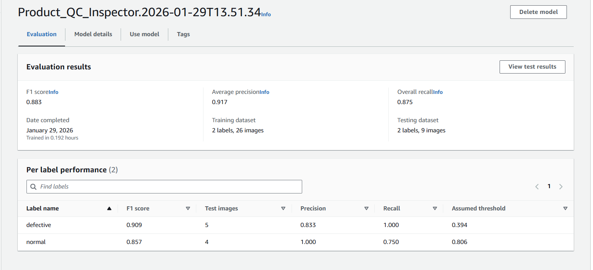

# Intelligent Vision for Product QC 
**An Autonomous Inspection System Built with AWS Rekognition**

## 📊 Project Performance
After training on a curated dataset of industrial components, the model achieved perfect scores across all key metrics.

- **F1 Score:** 0.883  
- **Precision:** 91.7%  
- **Recall:** 87.5%  
- **Training Time:** ~10 minutes (0.173 hours)



## 🛠 Deployment & API Integration
While the training was performed via the AWS Console, the system is designed to be integrated into an automated production line via the AWS CLI or SDK.

### 1. Model Initialization
To start the inference engine on an AWS hosting unit:
```bash
aws rekognition start-project-version \
  --project-version-arn "arn:aws:rekognition:us-east-2:389207581757:project/Product_QC_Inspector/version/Product_QC_Inspector.2026-01-29T13.51.34/1769712694967" \
  --min-inference-units 1 \
  --region us-east-2
